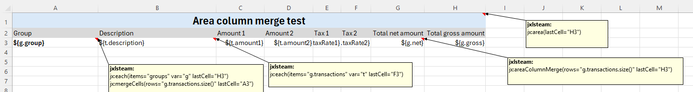
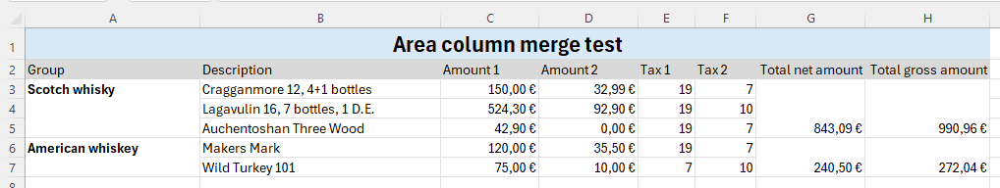

# Area column merge

```
jx:areaColumnMerge(rows="" lastCell="C2")
```

`rows`: Number of rows combined

`lastCell`: must be in same row and marks last column

When many adjacent columns need to be combined vertically in a jx:each row,
jx:areaColumnMerge simplifies the writing process compared to [jx:mergeCells](merge-cells.html).
See example template cell G3:



Result from testcase AreaColumnMergeTest:



This command can only be used on cells that have not been merged. An exception will occur if the scope of
the merged cell exists for the merged cell.

jx:areaColumnMerge is part of jxls-poi and is only available if you use JxlsPoiTemplateFillerBuilder or add the MergeCellsCommand using withCommand().

This command is a community contribution.
