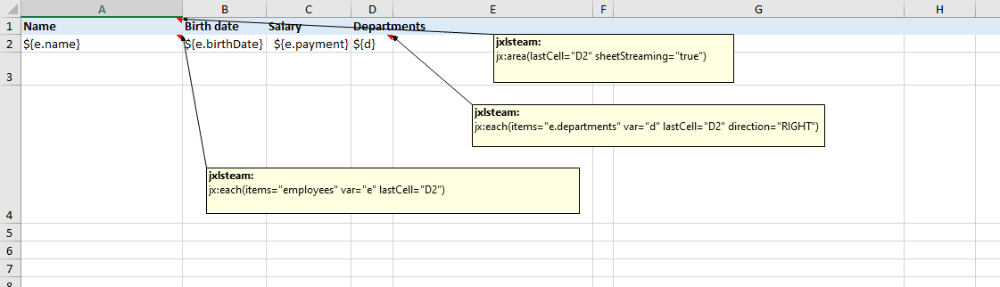
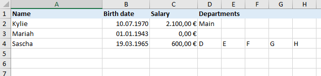
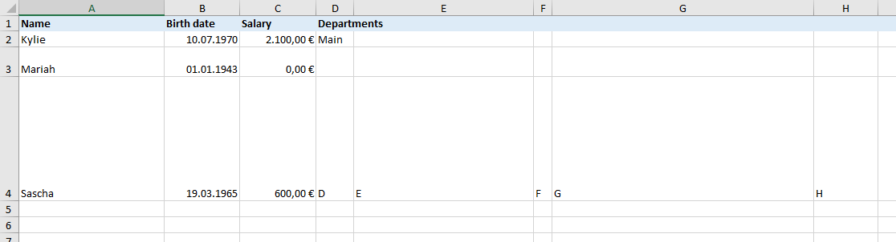

# Builder options

JxlsTemplateFillerBuilder is the starting point for creating Jxls reports (since version 3).
Jxls<u>Poi</u>TemplateFillerBuilder is the subclass in the jxls-poi project. It comes with a ready-configured
PoiTransformerFactory for creating the PoiTransformer.

Below is a list of all builder options.

## Expression evaluator

The default expression evaluator is `JexlExpressionEvaluator`. This evaluator caches engine and expressions in its thread.
This cache can be cleared by invoking `JexlExpressionEvaluator.clear()`.

Use `withExpressionEvaluatorFactory(new ExpressionEvaluatorNoThreadLocalFactoryJexlImpl())` if you
want to use a non-thread-local JEXL expression evaluator. This evaluator only caches expressions, but globally.
The cache can be cleared by invoking `JexlExpressionEvaluatorNoThreadLocal.clear()`.

Use `withExpressionEvaluatorFactory(new ExpressionEvaluatorFactoryJSR223Impl(lang))` if you
want to use a JSR223 compatible expression language specified by `lang`.

### Factory options

The ExpressionEvaluatorFactory classes for JEXL have three constructors and up to three arguments:

- no argument: non strict, silent, UNRESTRICTED mode (Backwards compatibility, default)
- strict (typically true): silent:=!strict, strict, UNRESTRICTED
- arguments silent, strict, permissions (recommended)

**silent**

Sets whether the engine will throw JexlException during evaluation when an error is triggered.
When not silent, the engine throws an exception when the evaluation triggers an exception or an error. *(from JEXL Javadoc)*

**strict**

Sets whether the engine considers unknown variables, methods, functions and constructors as errors or
evaluates them as null. When not strict, operators or functions using null operands return null on evaluation. When
strict, those raise exceptions. It is recommended to use strict=true. *(from JEXL Javadoc)*

**permissions**

This is an important topic and new in JEXL 3.3 / Jxls 3.0.

Use JxlsJexlPermissions.UNRESTRICTED for backward compatibility.
<span style="color: #e00;">JEXL expressions can then access everything!
Even [hacks](https://stackoverflow.com/a/53989523/19904503) like `${''.class.forName('any class').staticMethod()}` will be possible!</span>

Use JxlsJexlPermissions.RESTRICTED as opposite. Only scalar values in the given data map will be accessible.

Or use `new JxlsJexlPermissions(...src)` where src can be packages or class names that are allowed to be used.
See interface JexlPermissions for details.

If a class is not accessible JEXL will treat them as they do not exist. Error messages are not that helpful.

## Expression notations

Expressions in cells are inside `${` and `}`. Call `withExpressionNotation(begin, end)` if you want to change those Strings.
Example:

```
builder.withExpressionNotation("LBRACELBRACE", "}}")
```

## Logging

The `JxlsLogger` interface is the middleman between Jxls and a logger.
`PoiExceptionLogger` is the default logger if you use JxlsPoiTemplateFillerBuilder.
Use `JxlsPoiTemplateFillerBuilder#withExceptionThrower()` (or `withLogger(new PoiExceptionThrower())`)
if you want exceptions to be thrown.

|method|PoiExceptionLogger|PoiExceptionThrower|
|---|---|---|
|error|syserr|JxlsException|
|warn|syserr|syserr|
|info|sysout|sysout|
|debug|no output|no output|
|handle...Exception|warn or error|JxlsException|
|handle...|info|info|

```
withLogger(new YourLogger())
```

Or implement your own exception handling and logging using the JxlsLogger interface. You could subclass PoiExceptionLogger
and throw an exception in the error methods. In the debug, info and warn methods you could call your preferred logging framework.
Here are ready to use logging framework adapters. More can be contributed by the community.

- [SLF4J](slf4j.html)
- [Tinylog](tinylog.html)

## Formula processor

The Jxls formula processor is responsible for extending cell references in Excel formulas.

`StandardFormulaProcessor` is the default formula processor and suitable for all use cases.

Use `withFastFormulaProcessor()` (or `withFormulaProcessor(new FastFormulaProcessor())`) if you
want to use the fast formula processor. FastFormulaProcessor is 10 times faster but can handle only simple templates.
We cannot provide details when the FastFormulaProcessor can be used. You have to try it yourself for each template.
In production, only the StandardFormulaProcessor is usually used. In practice, the processing speed is usually increased
through the use of streaming (see below). This means that using the FastFormulaProcessor usually only makes sense
if many reports are to be generated based on a simple template.

Use `withFormulaProcessor(null)` if you want to disable formula processing. This makes only sense if the template
has no formulas that need to be extended by Jxls and you need the processing speed.

## Cell reference tracking

While performing an area transformation Jxls keeps track of all the processed cells so that it knows what are the target cells
for each particular source cell. If you do not have or do not need to process the formulas then it makes sense to disable
this functionality to save some memory. This can be done by calling `withUpdateCellDataArea(false)`.

## Ignoring column/row properties



Using the above template the output will look nice by default:



If you want to switch off that Jxls changes the column or row properties use

```
withIgnoreColumnProps(false)
withIgnoreRowProps(false)
```

and the result will loook like this:



## Recalculate formulas

Jxls let POI recalculate all formulas before saving. Use `withRecalculateFormulasBeforeSaving(false)` to turn this off.

If you want that all formulas will be recalculated on opening the report by Excel call `withRecalculateFormulasOnOpening(true)`.
By default this option is off because in most cases a recalculation on opening is not needed. It could maybe useful if your Excel file
contains pivot tables that rely on other sheets and other formulas.

If report creation time really matters it could be useful to use

```
withRecalculateFormulasBeforeSaving(false)
withRecalculateFormulasOnOpening(true)
```

## Keep template sheet

If you use the multisheet feature the template sheet will be deleted by default (DELETE).
Use `withKeepTemplateSheet(KeepTemplateSheet.KEEP)` for keeping the template sheet.
Or use the HIDE option for hiding the template sheet.
See also the jx:each/multisheet documentation.

## Area builder

Jxls uses by default the XlsCommentAreaBuilder. This class defines the command classes and defines the command syntax.
Implement the `AreaBuilder` interface and use `withAreaBuilder(...)` to change this.

```
public interface AreaBuilder {
    List<Area> build(Transformer transformer, boolean clearTemplateCells);
}
```

XlsCommentAreaBuilder implements the "note lastCell" syntax. See test class MarkerAreaBuilder in AreaBuilderTest.java in our Github
repository that implements the "note marker" syntax. The bottom right corner will be marked by a note containing a marker - instead
of using the lastCell attribute.

A custom area builder is also useful if you have an Excel template that must not contain notes. The solution is to add areas and commands
by Java code using withAreaBuilder:

```
builder.withAreaBuilder((transformer, ctc) -> {
    List<Area> areas = new ArrayList<>();	
    XlsArea area = new XlsArea("Employees!A1:C2", transformer);
    areas.add(area);
    XlsArea eachArea = new XlsArea("Employees!A2:C2", transformer);
    area.addCommand("A2:C2", new EachCommand("e", "employees", eachArea));
    eachArea.addCommand("A2:C2", new IfCommand("e.payment<2000",
        new XlsArea("Employees!A2:C2", transformer),
        new XlsArea("Employees!A3:C3", transformer)));
    return areas;
})
```


## Commands

Use `withCommand(commandName, commandObject)` for adding your own custom commands to Jxls. Imagine you extend EachCommand
as MyEachCommand then you must call `withCommand(EachCommand.COMMAND_NAME, new MyEachCommand())` so you can use it.

See also [Commands included](commands.html).

## Clear template cells

By default Jxls clears cells where the expression cannot be evaluated. Use `withClearTemplateCells(false)` for not clearing
those cells.

## Transformer

A Transformer class contains the central logic of Jxls.

```
public interface JxlsTransformerFactory {
    Transformer create(InputStream template, OutputStream outputStream, JxlsStreaming streaming, JxlsLogger logger);
}
```

Implement the above interface and use `withTransformerFactory()` if you want to use your own Transformer. jxls-poi contains
PoiTransformerFactory that creates a **PoiTransformer** or a subclass of it. If you use JxlsPoiTemplateFillerBuilder the PoiTransformerFactory
is already active. PoiTransformer is the Apache POI specific implementation for Jxls.

If you need to access the Transformer you can do this:

```
withTransformerFactory(new PoiTransformerFactory() {
    @Override
    public Transformer create(InputStream template, ...) {
        Transformer transformer = super.create(template, outputStream, streaming, logger);
        // access transformer here
        return transformer;
    }
}
```

## Streaming

See [Streaming](streaming.html)

## Needs PublicContext

Sometimes objects (e.g. custom functions) need the PublicContext, e.g. for expression evaluations.
You get this by implementing the NeedsPublicContext interface
and calling `needsPublicContext(object)`.

## Pre write actions

If you want to carry out an action before calling `Transformer.write()`, you can do this
with `withPreWriteActions((transformer, context) -> ...)` (PreWriteAction interface).
One use case could be performing POI operations, e.g. for grouping.

## Run var access

If you want to change the way how running variables are accessed, call `withRunVarAccess((name, data) -> your code)`.
The PublicContext.getRunVar() method is especially used to save loop variables. However, it is often the case that there is no entry for the key at all. If the map implementation reacts allergically to non-existent keys, you can change the behavior with withRunVarAccess().

## Template

With the above options you can create a builder ready to go for creating an Excel report. What you still need is a template and data.
Use one of these methods to specify the template file:

```
withTemplate(InputStream templateInputStream)
withTemplate(URL templateURL) 
withTemplate(File templateFile) 
withTemplate(String templateFileName)
```

## Output

After setting above builder options and the template you will receive a JxlsTemplateFiller by calling the build() method.
Call fill() on that object to create an Excel report. fill() has two arguments:

`Map<String, Object> data` is a map containing all the data to be accessed by the template. HashMap is the default implementation.
In Jxls 2 this was called Context.

`JxlsOutput output` is an interface which delivers you an OutputStream for writing the resulting Excel report.
JxlsOutputFile is the default implementation.

As base you need to fill the data map:

```
Map<String, Object> dataMap = new HashMap<>();
// add data to dataMap
```

and then call the builder and the template filler:

```
JxlsPoiTemplateFillerBuilder builder = JxlsPoiTemplateFillerBuilder.newInstance()
    // builder options...
    .withTemplate("filename.xlsx");
JxlsTemplateFiller filler = builder.build();
filler.fill(dataMap, new JxlsOutputFile(new File("report.xlsx")));
```

Output is report.xlsx in the current directory.

You can write it shorter:

```
JxlsPoiTemplateFillerBuilder.newInstance()
    // builder options...
    .withTemplate("filename.xlsx")
    .buildAndFill(dataMap, new JxlsOutputFile(new File("report.xlsx")));
```

Or even shorter for common use cases:

```
JxlsPoi.fill(templateInputStream, JxlsStreaming.STREAMING_OFF, dataMap, new File("report.xlsx"));
```
