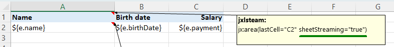

# Streaming

This topic is only relevant for Apache POI and the .xlsx file format.

Apache POI holds the .xlsx file content as many XML objects in memory. If you create a large report you will see the processing getting slower
and slower. And maybe you will get an OutOfMemory error. To prevent this you can activate streaming. In streaming mode jxls-poi will use
the POI SXSSF streaming classes instead of the XSSF classes.
Instead of holding the entire file in memory, each row is immediately written to disk. This requires significantly less memory and
makes the processing much faster.

But why isn't streaming enabled by default? Not all features can be used in streaming mode. For example, a formula in row 1 cannot
reference data in row 2 because row 2 doesn't yet exist. In short, streaming can only be used for large lists of simple data.
You have to try out for each template whether streaming is possible.

There are these builder options for streaming:

## STREAMING_OFF

Default is streaming off.

## STREAMING_ON

`withStreaming(JxlsStreaming.STREAMING_ON)` activates streaming for all sheets.

## AUTO_DETECT

`withStreaming(JxlsStreaming.AUTO_DETECT)` activates streaming for all sheets that have a note containing `sheetStreaming="true"`.
It has to be exactly this text. You cannot comment out this text, instead you have to delete it. This text is typically placed in cell A1 inside
the jx:area command. sheetStreaming is not an official command property. It's just a flag inside the template to turn on streaming.
This has the advantage that you can switch on streaming in the template, i.e. you don't have to do it in the code.



AUTO_DETECT is a very useful option in production. Simple data lists that can have many rows can be produced quickly using
`sheetStreaming="true"`. While sheets with complex formulas still work because streaming is not used here (no `sheetStreaming="true"`).

## streamingWithGivenSheets

Use `withStreaming(JxlsStreaming.streamingWithGivenSheets(String ...sheetNames))`
or `withStreaming(JxlsStreaming.streamingWithGivenSheets(Set<String> sheetNames))` for activating
streaming for given sheet names.

PoiTransformerFactory uses class SelectSheetsForStreamingPoiTransformer for all streaming=yes options.
PoiTransformer is used for the streaming=no option.

## Selecting sheets logic

If you need Java code for deciding what sheets are used for streaming you must subclass SelectSheetsForStreamingPoiTransformer,
overwrite useStreaming(sheetName), extend PoiTransformerFactory, overwrite createTransformer(...)
and activate that class using withTransformerFactory().

## More streaming options

```
withOptions(int rowAccessWindowSize, boolean compressTmpFiles, boolean useSharedStringsTable)
```

Use withOptions(...) for setting further streaming options. See JxlsStreaming and SXSSFWorkbook for further explanations.

## See also

- [Optimizations](optimizations)
