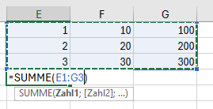
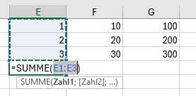
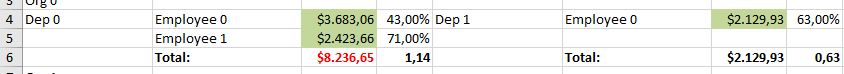
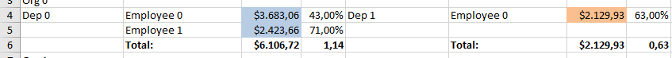

# Params

Params is a special command. It has no own command class, has no lastCell attribute and applies only to one cell.
Params knows two attributes: defaultValue and formulaStrategy.

## defaultValue

If the cells participating in a formula calculation are removed during processing then the formula value can become undefined or corrupted.
To avoid this situation starting from version 2.2.8 Jxls sets such formula to "=0".
To use custom default value for such formulas use the jx:params command  with the defaultValue* attribute:

```
jx:params(defaultValue="1")
```

This sets the default formula value to 1.

## formulaStrategy

```
jx:params(formulaStrategy="BY_COLUMN")
```

Using this command for one cell means the formula processor will take only cell references in the same column as the original cell.
This is useful if you use a column sum in a colum where jx:each/direction=RIGHT is used.



See the above report output as an illustration. There's a jx:each/direction=RIGHT in column E in the template.
Without `jx:params(formulaStrategy="BY_COLUMN")` in cell E4 the Jxls formula processor would expand the sum to cell area E1:G3.
But we want a sum for each column. So we have to use `jx:params(formulaStrategy="BY_COLUMN")` in cell E4 to get this:



Here is a more real world example. In the template the first four columns are direction=RIGHT columns.
Instead of creating a sum of the green areas



a sum is wanted for each column (blue and red areas):


