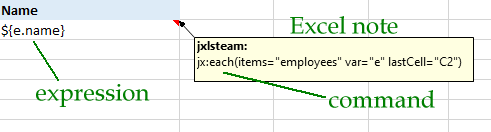

# How to write a Jxls Excel template

With Jxls you can easily create Excel reports because you also create the report template with Excel.
Such a template consists of notes that contain commands and cells that contain expressions.

See

- [Commands](../commands)
- [Expressions](../expressions)

## Tool and formats

Please create templates exclusively with Microsoft Excel. The reports created can also be opened with alternative programs.

Jxls supports .xlsx and .xls formats, with .xlsx being preferred. .xlsm should also work.
