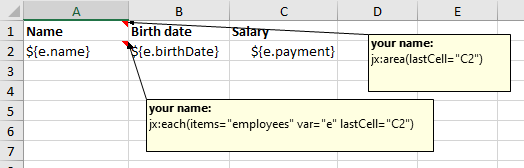
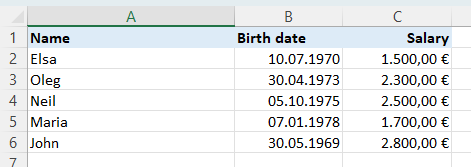

# Getting started guide

Let's assume that we want to output an employee list as an Microsoft Excel report.

## POJO

The employees are available as a POJO class and there is some code for retrieving the employee list:

```
public class Employee {
    private String name;
    private Date birthDate;
    private BigDecimal payment;
    // getters/setters ...
}

List<Employee> employees = ...
```

If you want to reuse code from us see Employee.java and Employee#generateSampleEmployeeData() in our Github repository.

## Template

The advantage of Jxls is that reports do not have to be programmed. Instead templates will be used.
We now create such a template. Please only use Microsoft Excel for this. Create a new Excel file template.xlsx with this content:



If you want to reuse a template from us see EachTest.xlsx in our Github repository.

### Template description

There's a note in cell A1 (which can be added right-clicking in the cell > New Note):

```
jx:area(lastCell="C2")
```

and another note in cell A2:

```
jx:each(items="employees" var="e" lastCell="C2")
```

and some expressions in cells A2 to C2. Processing instructions are placed into Excel notes. We call them commands. Above you see
a jx:area command for defining the cells where Jxls do its processing. The jx:each command is used for iterating over an list.
There will be no Excel notes in the output because Jxls will remove them.

Expressions are inside `${...}`. Here we see the running variable `e` followed by the simple property name, separated by a dot.

### Formatting

What you don't see in the screenshot that there is also formatting. Column B is formatted as date, column C is formatted as currency.
And then row A is bold and has cell style General.

## Add jxls-poi.jar

Add Jxls as a Maven dependency to your project:

```
<dependency>
    <groupId>org.jxls</groupId>
    <artifactId>jxls-poi</artifactId>
    <version>{{version}}</version>
</dependency>
```

Or add Jxls as a Gradle dependency to your project:

```
implementation 'org.jxls:jxls-poi:{{version}}'
```

## Code for report creation

Create a Java class with a main() method and these Java lines:

```
Map<String, Object> data = new HashMap<>();
data.put("employees", employees);
JxlsPoiTemplateFillerBuilder.newInstance()
        .withTemplate("template.xlsx")
        .build()
        .fill(data, new File("report.xlsx"));
```

Run the code and you will see something like that in report.xlsx:



And that's it!
