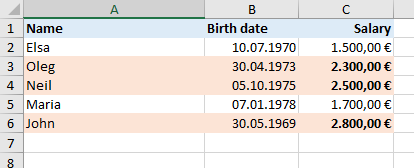
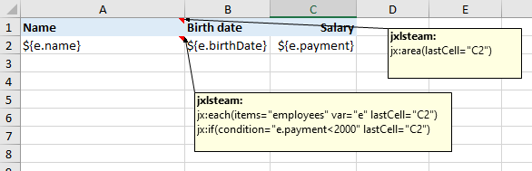
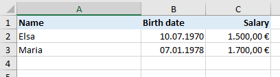

# If
<!-- K=If command -->

Use the jx:if command for showing/hiding cells based on a condition expression. It's like if or if+else in Java.

```
jx:if(condition="e.payment<2000" lastCell="C2" areas=["A2:C2","A3:C3"])
```




`condition`: show area if expression result is true otherwise hide if area;
show else area if expression result is not true otherwise hide else area.
Result null should be avoided, but would be treated (since version 3) as false.

`lastCell`: area end of if part

`areas`: the first part is the if area, the second part is the else area

If you don't need an else area and are inside a jx:each block you should better use jx:each with the select attribute
instead of writing jx:if.

```
jx:each(items="employees" var="e" select="e.payment<2000" lastCell="C2")
```

But anyway, here's a jx:if example of how to do it without an else area:

```
jx:if(condition="e.payment<2000" lastCell="C2")
```




