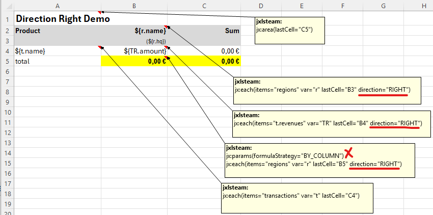

# Direction RIGHT <!-- ** -->

Imagine a report with dynamic columns. In this example one column per region (see DirectionRightTest.java/.xlsx).
With region name and HQ in the header and sum in the footer.

This is the template:

You must specify a jx:each(direction="RIGHT") for the header, for
the row section and for the footer (if exist).
For the column totals to work, [jx:params(formulaStrategy="BY_COLUMN")](params.html) must be specified in the
corresponding cell note (B5).

An even more complex report using multisheet, grouping, and select functions would be conceivable.
However, we will not present that, as we prefer to showcase the individual concepts.

[see also group sum](special-features.html)
