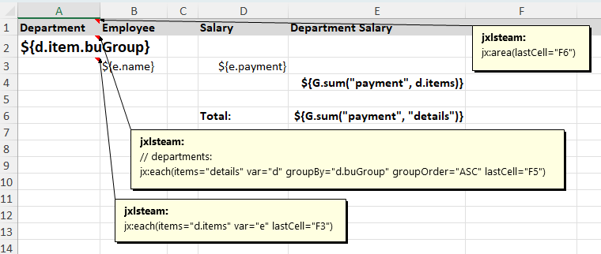
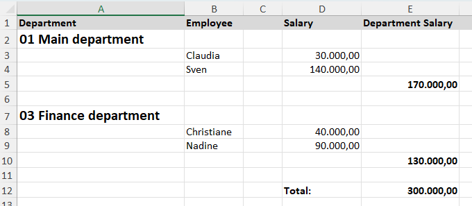

# Special features

## Parameterized formulas

Parameterized formula allows you to use context variables in the formula.

To set a parameterized formula you have to enclose it into `$[` and `]` symbols and each formula variable
must be enclosed in `${` and `}`
symbols. For example `$[SUM(E4) * ${bonus}]`. Here we use bonus context variable in the formula. During the processFormulas()
Jxls will substitute all the variables with values from the context.


## Jointed cell references

If your formula refers to cells from different areas which should be combined into a single range or cell sequence you may use so
called jointed cell reference notation combined with the parameterized formulas e.g.

```
$[SUM(U_(F8,F13))]
```

Note U_() notation which will tells Jxls to use both cells F8 and F13 and combine the target cells into a single cell sequence or range if possible.

## Group sum

Jxls ships a GroupSum class. Add it to the data map to use its sum() method.
The first argument is the property name for the sum formation.
The second argument is either an expression in quotes or an Iterable (without quotes).

```
g = new GroupSum<Double>(new DoubleSummarizerBuilder());
data.put("G", g);
builder.needsPublicContext(g);

big = new GroupSum<BigDecimal>(new BigDecimalSummarizerBuilder())
data.put("Gbig", big);
builder.needsPublicContext(big);
```





There is another variant with additional filtering. When using expressions, setTransformationConfig() must be called.
See also GroupSum Javadoc and GroupSumTest.

## National language support

With `R{key}` in the Excel .xlsx template file, resource bundles can be accessed to realize multilingualism.
This is the Jxls standard solution since 2.8.0. It is particularly necessary when using PivotTables.
Usually this class is called before the actual Jxls processing in order to create
a modified temporary template file from the given template file.
With `R{key=defaultValue}`, a default value can be specified for the case that there is no value for the key.
Otherwise key is the fallback value.
The notation can be adjusted using setStart, setEnd and setDefaultValueDelimiter.

## Shift mode

Command has a shiftMode property. You can set it to "inner" (default) or "adjacent".

InnerCellShiftStrategy shifts only cells directly impacted by the cells being shifted.
E.g. if a cell in column X is being shifted down it shifts all the other cells
located below the shifted cell in the column X.

AdjacentCellShiftStrategy shifts not only cells impacted by shifting area but also the adjacent area cells.

## Lock range

Set setLockRange(Boolean.TRUE) to a command
and other commands will no longer execute in this area after locking.

## AreaListener

Area listeners can be used to perform an additional area processing in response to area transformation events.
For example you may want to highlight some rows or cells depending on the data.

The AreaListener interface looks like this

```
public interface AreaListener {
    // is invoked just before the cell processing is going start
    void beforeApplyAtCell(CellRef cellRef, Context context);
    
    // invoked after the cell processing already completed
    void afterApplyAtCell(CellRef cellRef, Context context);
    
    // is invoked when the cell is about to be transformed by a transformer
    void beforeTransformCell(CellRef srcCell, CellRef targetCell, Context context);
    
    // is invoked after the cell was transformed by a transformer
    void afterTransformCell(CellRef srcCell, CellRef targetCell, Context context);
}
```

When a cell in the corresponding cell area is being transformed a corresponding method is being invoked.
Each listener method gets a cell reference to the cell being transformed and the context.
Transformation listener methods also get the target cell reference.

Here some code how to add an AreaListener. See also HighlightDemo.

```
withAreaBuilder(new XlsCommentAreaBuilder() {
    @Override
    public List<Area> build(Transformer transformer, boolean ctc) {
        List<Area> areas = super.build(transformer, ctc);
        addAreaListener(<areaListener>, <areaRef>, areas);
        return areas;
    }
}));
```

## Pivot table

If you want to create a pivot table (also called a crosstab), first create a Sheet A with data.
Then create the pivot table on Sheet B using normal Excel tools.
Enable the pivot table option 'Refresh when opening file'. Then replace the data in Sheet A again with the jx:each command.

## SimpleExporter

You can export a list of objects into Excel with a single line of code by using SimpleExporter class.
This is achieved by using a special built-in template containing the [jx:grid command](grid.html).

Just create a SimpleExporter instance and run its `gridExport` method:

```
new SimpleExporter().gridExport(headers, dataObjects, propertyNames, outputStream);
```

Where 

`headers`: a collection of headers

`dataObjects`: a collection of data objects

`propertyNames`: a comma-separated list of object property names

`outputStream` an OutputStream to write the final Excel      

Call registerGridTemplate() for registering your own custom template. The template must contain the jx:grid command.
